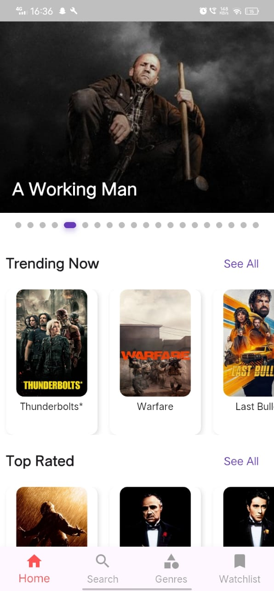

# 🎬 Movie Review App

A cross-platform mobile application built using **Flutter** that allows users to explore detailed information about movies including title, plot, cast, genre, ratings, and more. The app fetches data in real-time from **The Movie Database (TMDb) API**, offering a smooth and intuitive movie discovery experience.

---

## 📱 Features

- 🔍 Search for movies by title  
- 🎞️ View detailed movie information (plot, genre, cast, release date, etc.)  
- 🌐 Fetch data using TMDb API  
- 🖼️ Display movie posters and backdrops  
- 📱 Responsive UI for Android & iOS  
- 🌙 Dark and light mode support (optional)  

---

## 🛠️ Tech Stack

- **Framework**: Flutter  
- **Language**: Dart  
- **API**: [TMDb API](https://www.themoviedb.org/documentation/api)  
- **IDE**: Android Studio / VS Code  

---

## 📸 Screenshots

> Add screenshots here  
>   
> 

---

## 🚀 Getting Started

### Prerequisites

- Flutter SDK installed  
- Android Studio or VS Code  
- A TMDb API Key (create a free account at [TMDb](https://www.themoviedb.org))

### Installation

1. **Clone the Repository**
   ```bash
   git clone https://github.com/your-username/movie-review-app.git
   cd movie-review-app
